# Trilha de Evolução — Do Motor Especializado à Linguagem Completa

Este documento mapeia o estado atual da **LIAF (Language for AI First)**, os marcos para sua consolidação como linguagem de programação completa e independente, e os braços verticais do ecossistema.

---

## 1. Trilha de Maturidade (Roadmap Visual)

```mermaid
flowchart TD
    %% Estilos dos Nós
    classDef done fill:#1b4332,stroke:#2d6a4f,stroke-width:2px,color:#d8f3dc;
    classDef current fill:#083344,stroke:#0891b2,stroke-width:2px,color:#cffafe;
    classDef future fill:#1e1b4b,stroke:#4f46e5,stroke-width:2px,color:#e0e7ff;
    classDef branch fill:#312e81,stroke:#818cf8,stroke-width:2px,color:#ffffff;

    subgraph FASE1["Fase 1: Fundação Concluída (Hoje)"]
        A1["Sintaxe Canônica S-Expr v0.2"]:::done
        A2["Lexer & Parser Determinístico"]:::done
        A3["Codegen Go Nativo Estático"]:::done
        A4["CLI 'liafc' (check, emit, run, build)"]:::done
        A5["VFS Sandbox & Hot-Reload em RAM"]:::done
    end

    subgraph FASE2["Fase 2: Linguagem de Programação Completa"]
        B1["Type & Effect Checker Estrito"]:::current
        B2["Diagnósticos JSON Mecânicos (Self-Healing IA)"]:::current
        B3["Tipos Estruturados (Lists, Maps, Enums/Unions)"]:::future
        B4["Pattern Matching & Laços Canônicos"]:::future
        B5["Stdlib Expandida (OS, FS, HTTP, Crypto)"]:::future
    end

    subgraph FASE3["Fase 3: Emancipação e Autonomia Total"]
        C1["VM Bytecode Nativa ou Backend LLVM/Cranelift"]:::future
        C2["Eliminação da Dependência do Compilador Go"]:::future
        C3["Package Manager ('liaf get / liaf publish')"]:::future
        C4["LSP Nativo (Language Server Protocol)"]:::future
    end

    FASE1 --> FASE2
    FASE2 --> FASE3

    %% Braços do Ecossistema
    subgraph BRACOS["Braços do Ecossistema LIAF"]
        BR1["🌐 Braço Web Engine & SSG<br/>- Zero dependências<br/>- Servidor em ~2.4 MB RAM<br/>- Cache atômico e Markdown nativo"]:::branch
        BR2["🤖 Braço AI-Agent First<br/>- Gramática de inferência barata<br/>- Auto-cura mecânica guiada por JSON<br/>- Adequada para modelos pequenos (SLMs)"]:::branch
        BR3["⚡ Braço Concorrência & Atores<br/>- Canais tipados<br/>- Efeitos colaterais explícitos<br/>- Modelo Erlang/Go sem race conditions"]:::branch
    end

    FASE2 -.-> BRACOS
    FASE3 -.-> BRACOS
```

---

## 2. Status Detalhado: O que temos vs. O que falta

| Componente | Situação | Quando atinge nível de linguagem completa? |
|---|---|---|
| **Gramática & AST** | Concluído (v0.2 canônica) | Já é uma linguagem formal especificada. |
| **Lexer & Parser** | Concluído e testado | Produz AST semântica com coordenadas precisas. |
| **Codegen & Runner** | Concluído (`liafc run/build`) | Gera binários nativos funcionais. |
| **Type & Effect Checker** | **Próximo Passo** | Transforma o compilador em um validador estrito antes de executar. |
| **Independência do Go** | Fase 3 | Quando o compilador emitir código de máquina direto (LLVM/Cranelift/VM) sem precisar do Go instalado. |

---

## 3. Os 3 Grandes Braços da LIAF

1. **Braço Web Engine (Runtime Ultra-Eficiente)**:
   - Alternativa nativa ao Nginx/Hugo/Node.js rodando em 2 MB de RAM com VFS e hot-reload atômico.
2. **Braço AI-First (Linguagem para Modelos de IA)**:
   - Projetada para SLMs (modelos pequenos e baratos) acertarem código de primeira ou corrigirem com patches de 1 linha.
3. **Braço Concorrência Massiva (Atores & Canais)**:
   - Concorrência declarada na assinatura de efeitos (`spawn`, `clock`, `net`) impedindo operações perigosas ocultas.
